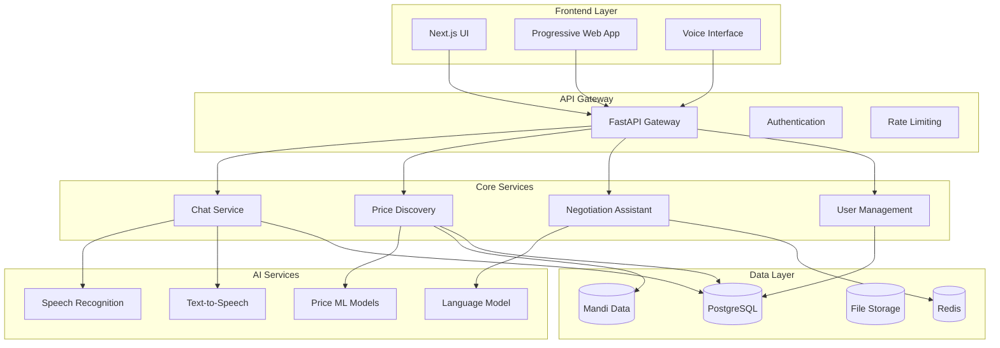

# Design Document: OpenMandi

## Overview

OpenMandi is a voice-first, multilingual web application that facilitates agricultural trading through AI-powered price discovery and negotiation assistance. The system prioritizes accessibility for low-literacy users while providing sophisticated AI capabilities for fair market transactions.

The architecture follows a modern web application pattern with a Next.js frontend, FastAPI backend, and integrated AI services for speech processing, price analysis, and negotiation assistance.

## Architecture

### High-Level Architecture



### Technology Stack

- **Frontend**: Next.js 14 with TypeScript, Tailwind CSS, PWA capabilities
- **Backend**: FastAPI with Python 3.11, async/await patterns
- **AI Services**: OpenAI Whisper, Azure Cognitive Services TTS, OpenAI GPT-4
- **Database**: PostgreSQL for structured data, Redis for caching and sessions
- **Infrastructure**: Docker containers, cloud-ready deployment
- **Real-time**: WebSocket connections for voice chat, Server-Sent Events for updates

## Components and Interfaces

### Frontend Components

#### Voice Interface Component
```typescript
interface VoiceInterface {
  startRecording(): Promise<void>
  stopRecording(): Promise<AudioBlob>
  playAudio(audioUrl: string): Promise<void>
  onTranscriptionReceived(callback: (text: string) => void): void
  onAudioReceived(callback: (audioUrl: string) => void): void
}
```

#### Low-Literacy UI Components
```typescript
interface AccessibleUI {
  // Large touch targets, minimal text
  BigButton: React.Component<{
    icon: IconType
    label: string
    audioLabel: string
    onClick: () => void
  }>
  
  // Visual price display with audio
  PriceDisplay: React.Component<{
    price: number
    currency: string
    confidence: number
    explanation: string
  }>
  
  // Voice-guided navigation
  VoiceNavigation: React.Component<{
    currentStep: string
    totalSteps: number
    onNext: () => void
    onPrevious: () => void
  }>
}
```

### Backend API Interfaces

#### Chat Service API
```python
class ChatAPI:
    async def create_session(user_id: str, product_type: str) -> ChatSession
    async def join_session(session_id: str, user_id: str) -> bool
    async def send_voice_message(session_id: str, audio_data: bytes) -> VoiceMessage
    async def get_session_history(session_id: str) -> List[Message]
    async def end_session(session_id: str) -> SessionSummary
```

#### Price Discovery API
```python
class PriceDiscoveryAPI:
    async def get_price_suggestion(
        product: str, 
        quantity: float, 
        location: str,
        quality_grade: str
    ) -> PriceSuggestion
    
    async def get_market_trends(
        product: str, 
        time_range: str
    ) -> MarketTrends
    
    async def explain_price_factors(
        product: str, 
        suggested_price: float
    ) -> PriceExplanation
```

#### Negotiation Assistant API
```python
class NegotiationAPI:
    async def analyze_offer(
        session_id: str,
        offer: Offer,
        context: NegotiationContext
    ) -> OfferAnalysis
    
    async def suggest_counter_offer(
        current_offer: Offer,
        user_constraints: UserConstraints
    ) -> CounterOfferSuggestion
    
    async def evaluate_deal_fairness(
        final_terms: DealTerms
    ) -> FairnessAssessment
```

### AI Service Interfaces

#### Speech Processing
```python
class SpeechProcessor:
    async def transcribe_audio(
        audio_data: bytes, 
        language_code: str,
        dialect_hints: List[str]
    ) -> TranscriptionResult
    
    async def synthesize_speech(
        text: str, 
        language_code: str,
        voice_profile: VoiceProfile
    ) -> AudioData
    
    async def detect_language(audio_data: bytes) -> LanguageDetection
```

#### AI Reasoning Engine
```python
class AIReasoningEngine:
    async def generate_price_explanation(
        price_data: PriceData,
        market_context: MarketContext,
        user_literacy_level: str
    ) -> Explanation
    
    async def simulate_negotiation_scenario(
        scenario_params: ScenarioParams
    ) -> SimulationResult
    
    async def check_ethical_concerns(
        transaction_data: TransactionData
    ) -> EthicalAssessment
```

## Data Models

### Core Entities

#### User Model
```python
class User:
    id: UUID
    phone_number: str  # Primary identifier for low-literacy users
    preferred_language: str
    dialect_region: str
    literacy_level: LiteracyLevel
    user_type: UserType  # BUYER, SELLER, BOTH
    trust_score: float
    created_at: datetime
    last_active: datetime
```

#### Product Model
```python
class Product:
    id: UUID
    name: str
    category: ProductCategory
    seasonal_availability: List[Month]
    standard_units: List[Unit]
    quality_grades: List[QualityGrade]
    regional_names: Dict[str, str]  # Language -> local name
```

#### Chat Session Model
```python
class ChatSession:
    id: UUID
    buyer_id: UUID
    seller_id: UUID
    product_id: UUID
    status: SessionStatus
    language: str
    created_at: datetime
    ended_at: Optional[datetime]
    final_deal: Optional[Deal]
```

#### Message Model
```python
class Message:
    id: UUID
    session_id: UUID
    sender_id: UUID
    content_type: MessageType  # VOICE, TEXT, SYSTEM
    original_audio_url: Optional[str]
    transcribed_text: str
    translated_text: Dict[str, str]  # Language -> translation
    timestamp: datetime
    ai_analysis: Optional[MessageAnalysis]
```

#### Price Data Model
```python
class PriceData:
    id: UUID
    product_id: UUID
    market_location: str
    price_per_unit: Decimal
    unit_type: Unit
    quality_grade: QualityGrade
    date_recorded: date
    source: DataSource
    confidence_score: float
    seasonal_factor: float
```

#### Mandi Data Model
```python
class MandiRecord:
    id: UUID
    market_name: str
    state: str
    district: str
    product_name: str
    variety: str
    min_price: Decimal
    max_price: Decimal
    modal_price: Decimal  # Most common price
    date: date
    arrival_quantity: float
    unit: str
```

### AI-Specific Models

#### Negotiation Context
```python
class NegotiationContext:
    session_id: UUID
    current_offer: Offer
    offer_history: List[Offer]
    market_price_range: PriceRange
    user_constraints: Dict[UUID, UserConstraints]
    cultural_context: CulturalContext
    ethical_flags: List[EthicalFlag]
```

#### Confidence Band
```python
class ConfidenceBand:
    price_estimate: Decimal
    confidence_level: float  # 0.0 to 1.0
    lower_bound: Decimal
    upper_bound: Decimal
    factors: List[ConfidenceFactor]
    data_quality_score: float
```

## Correctness Properties

*A property is a characteristic or behavior that should hold true across all valid executions of a system—essentially, a formal statement about what the system should do. Properties serve as the bridge between human-readable specifications and machine-verifiable correctness guarantees.*

### Core System Properties

**Property 1: Speech Processing Round-Trip Consistency**
*For any* audio input in a supported language, transcribing to text and then synthesizing back to speech should preserve the semantic meaning and be recognizable in the original language
**Validates: Requirements 1.1, 1.2**

**Property 2: Language Adaptation and Consistency**
*For any* user language preference change during a session, the system should adapt all subsequent interactions to the new language while maintaining consistent translation of agricultural terminology
**Validates: Requirements 1.3, 2.2, 2.3, 2.5**

**Property 3: Price Discovery with Explanation**
*For any* product price query, the system should provide a price suggestion based on available mandi data and include an explanation of the factors influencing the price
**Validates: Requirements 3.1, 3.2, 3.3, 3.4**

**Property 4: Negotiation Assistance and Fairness**
*For any* negotiation session, the system should provide real-time guidance, evaluate deal fairness, and suggest compromise solutions when impasses occur
**Validates: Requirements 4.1, 4.2, 4.3, 4.4, 4.5**

**Property 5: Error Communication Accessibility**
*For any* system error or unclear input, the system should communicate problems through audio and visual cues rather than text messages, prioritizing voice feedback
**Validates: Requirements 5.4, 5.5**

**Property 6: Data Encryption and Security**
*For any* user data (voice recordings, transcripts, personal information), the system should encrypt the data during transmission and storage using industry-standard encryption
**Validates: Requirements 6.1, 6.3, 10.2**

**Property 7: Data Lifecycle Management**
*For any* data update or deletion request, the system should maintain historical records for trend analysis while completely removing personal data when requested, preserving only anonymized market data
**Validates: Requirements 6.2, 6.5**

**Property 8: Real-Time Communication Reliability**
*For any* chat session, the system should establish voice communication within 3 seconds, deliver messages with sub-500ms latency, and automatically recover from interruptions while preserving session state
**Validates: Requirements 7.1, 7.2, 7.5**

**Property 9: Concurrent Session Management**
*For any* multi-user session, the system should manage turn-taking to prevent audio conflicts and maintain communication quality even under poor network conditions
**Validates: Requirements 1.5, 7.3, 7.4**

**Property 10: Authentication and Access Control**
*For any* user authentication attempt, the system should use secure multi-factor mechanisms and enforce role-based access controls for all data access
**Validates: Requirements 10.1, 10.3**

**Property 11: Security Monitoring and Response**
*For any* detected suspicious activity, the system should alert administrators, temporarily restrict access, and provide privacy control options to users
**Validates: Requirements 10.4, 10.5**

**Property 12: Dialect and Cultural Context Processing**
*For any* regional dialect input containing agricultural terms or cultural references, the system should recognize dialect-specific terminology, convert regional units accurately, and adapt to formal/colloquial speech patterns
**Validates: Requirements 11.1, 11.2, 11.3, 11.4, 11.5**

**Property 13: Confidence Band Calculation**
*For any* price recommendation, the system should calculate confidence bands based on data quality, market volatility, source reliability, and unusual market conditions, clearly indicating uncertainty levels
**Validates: Requirements 12.1, 12.2, 12.3, 12.4**

**Property 14: Simulation and Learning Support**
*For any* negotiation simulation session, the system should generate realistic scenarios, provide performance feedback, offer adaptive tutorials for struggling users, and suggest specific learning resources
**Validates: Requirements 13.2, 13.3, 13.4, 13.5**

**Property 15: AI Explainability and Transparency**
*For any* AI recommendation or decision, the system should provide explanations in simple language, break down decision factors when requested, explain confidence changes, and prioritize the most significant factors
**Validates: Requirements 14.1, 14.2, 14.3, 14.4**

**Property 16: Ethical Safeguards and Protection**
*For any* pricing or negotiation scenario, the system should detect potential exploitation, intervene against predatory pricing, provide additional protection for vulnerable users, alert on market manipulation, and pause negotiations when ethical concerns arise
**Validates: Requirements 15.1, 15.2, 15.3, 15.4, 15.5**

**Property 17: Market Data Integration and Quality**
*For any* new product or data quality issue, the system should establish baseline pricing using comparable products, flag unreliable data, seek alternative sources, and factor seasonal variations into recommendations
**Validates: Requirements 8.3, 8.4, 8.5**

**Property 18: Backup and Recovery Operations**
*For any* backup operation, the system should perform automated backups without service interruption while maintaining data integrity and availability
**Validates: Requirements 6.4**

## Error Handling

### Voice Processing Errors

**Audio Quality Issues**
- Implement noise reduction and audio enhancement before processing
- Provide clear audio feedback when input quality is insufficient
- Offer alternative input methods (text fallback) when voice fails repeatedly
- Use confidence scoring to determine when to request re-recording

**Language Detection Failures**
- Maintain language preference history for fallback
- Implement progressive language detection (start with user's preferred language)
- Provide language selection UI when automatic detection fails
- Support manual language override at any time

**Speech Recognition Errors**
- Implement confidence thresholds for transcription acceptance
- Provide playback of original audio for verification
- Allow users to correct transcriptions through voice re-recording
- Maintain context to improve recognition accuracy over time

### AI Service Errors

**Price Discovery Failures**
- Implement graceful degradation when mandi data is unavailable
- Provide historical price ranges when real-time data fails
- Use cached price data with clear staleness indicators
- Offer manual price input as fallback option

**Negotiation Assistant Errors**
- Continue basic chat functionality when AI assistance fails
- Provide simple price comparison tools as fallback
- Cache common negotiation advice for offline scenarios
- Allow users to proceed without AI assistance if preferred

**Model Availability Issues**
- Implement circuit breaker patterns for AI service calls
- Provide cached responses for common queries
- Degrade gracefully to rule-based systems when ML models fail
- Queue requests for retry when services recover

### Network and Infrastructure Errors

**Connection Failures**
- Implement automatic reconnection with exponential backoff
- Cache critical data locally for offline functionality
- Provide clear connection status indicators
- Support offline mode for basic price lookup

**Database Errors**
- Implement read replicas for high availability
- Use connection pooling with health checks
- Provide cached data when database is unavailable
- Implement data consistency checks and repair mechanisms

**Real-time Communication Errors**
- Fallback to polling when WebSocket connections fail
- Implement message queuing for delivery guarantees
- Provide connection quality indicators to users
- Support asynchronous communication when real-time fails

### User Experience Error Handling

**Low-Literacy User Support**
- Use audio error messages instead of text
- Provide visual error indicators (colors, icons)
- Implement guided recovery flows with voice instructions
- Offer human support escalation options

**Cultural and Language Errors**
- Provide culturally appropriate error explanations
- Support error messages in user's preferred language
- Implement cultural context awareness in error handling
- Offer region-specific help and support options

## Testing Strategy

### Dual Testing Approach

The testing strategy employs both unit testing and property-based testing to ensure comprehensive coverage:

**Unit Tests**: Focus on specific examples, edge cases, and integration points
**Property Tests**: Verify universal properties across all possible inputs using randomized testing

This dual approach ensures that unit tests catch concrete bugs while property tests verify general correctness across the entire input space.

### Property-Based Testing Configuration

**Testing Framework**: Use Hypothesis (Python) for backend property tests and fast-check (TypeScript) for frontend property tests

**Test Configuration**:
- Minimum 100 iterations per property test to ensure statistical confidence
- Each property test must reference its corresponding design document property
- Tag format: **Feature: openmandi, Property {number}: {property_text}**

**Property Test Implementation**:
- Each correctness property must be implemented by exactly one property-based test
- Property tests should generate realistic agricultural market data
- Tests must cover multiple languages and dialects for multilingual properties
- Audio generation for speech processing tests using synthetic voice samples

### Unit Testing Strategy

**Component-Level Testing**:
- Test specific API endpoints with known inputs and expected outputs
- Test error conditions and edge cases not covered by property tests
- Test integration between frontend and backend components
- Test database operations and data consistency

**Integration Testing**:
- Test complete user workflows (registration → chat → negotiation → deal)
- Test cross-language communication scenarios
- Test AI service integration with mock and real services
- Test real-time communication under various network conditions

**Accessibility Testing**:
- Test low-literacy UI components with screen readers
- Test voice navigation flows
- Test visual indicator functionality
- Test audio feedback systems

### AI and ML Testing

**Model Validation**:
- Test speech recognition accuracy across supported languages
- Test price prediction accuracy against historical data
- Test negotiation advice quality through simulation
- Test bias detection in AI recommendations

**Explainability Testing**:
- Verify that all AI decisions include explanations
- Test explanation quality and comprehensibility
- Test explanation consistency across similar scenarios
- Test explanation adaptation for different literacy levels

### Performance and Load Testing

**Scalability Testing**:
- Test concurrent user limits (target: 100+ simultaneous sessions)
- Test database performance under load
- Test AI service response times under various loads
- Test real-time communication quality with multiple users

**Network Resilience Testing**:
- Test functionality under poor network conditions
- Test offline mode capabilities
- Test reconnection and state recovery
- Test adaptive streaming quality

### Security Testing

**Data Protection Testing**:
- Verify encryption of voice data in transit and at rest
- Test access control enforcement
- Test data deletion and anonymization
- Test privacy control functionality

**Vulnerability Testing**:
- Test authentication and authorization mechanisms
- Test input validation and sanitization
- Test protection against common web vulnerabilities
- Test AI model security and prompt injection resistance

### Continuous Testing

**Automated Test Pipeline**:
- Run unit tests on every code commit
- Run property tests on pull requests
- Run integration tests on staging deployments
- Run performance tests on release candidates

**Monitoring and Alerting**:
- Monitor test execution times and failure rates
- Alert on property test failures (may indicate data quality issues)
- Track test coverage metrics
- Monitor AI model performance in production

### Test Data Management

**Synthetic Data Generation**:
- Generate realistic mandi price data for testing
- Create diverse voice samples for speech testing
- Generate multilingual test content
- Create user personas for accessibility testing

**Data Privacy in Testing**:
- Use anonymized production data where appropriate
- Implement data masking for sensitive information
- Ensure test data complies with privacy regulations
- Regularly refresh and rotate test datasets